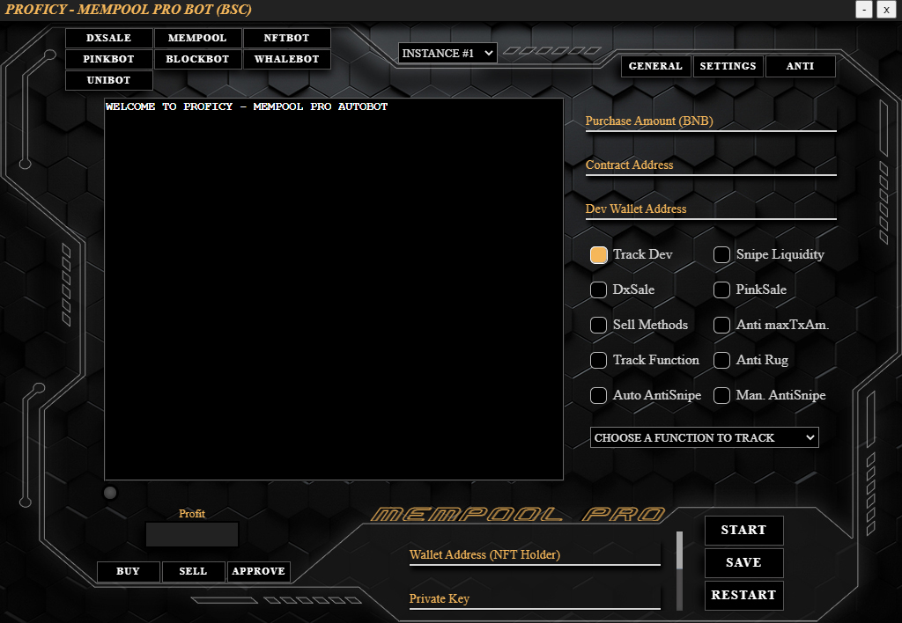

# BOT GUIDE

## DISCLAIMER  
PROFICY is not liable for any loss of funds through the use of the available bots or connecting your wallet to our minting dashboard. This includes every possible scenario (f.e. bad trading habits, a user being victim of a cyber attack, servers being attacked, buying cryptocurrencies run by malicious developers, etc.)  

We explcitly recommend **NOT TO USE YOUR MAIN WALLET** for any of our bots or to mint an NFT through our website. This is common practice with these kind of products and should always be kept this way.  

We at PROFICY took every available measure to prevent anything bad to happen on our end.  

## TABLE OF CONTENTS
[**CHANGELOG**](#changelog)  
[**GENERAL**](#general)  
[**MEMPOOL/BLOCKBOT**](#mempoolblockbot)  
[**DXSALE/PINKSALE BOT**](#dxsalepinksale-bot)  
[**NFT BOT**](#nft-bot)  
[**WHALEBOT**](#whalebot)  
  

## CHANGELOG
### v1.0.4 2021-11-17
* [Bugfix] Fixed a bug affecting auto fetching sniper contract (Mempool, Blockbot)
### v1.0.4 2021-11-15
* [Bugfix] Fixed calculation to auto deposit WBNB to custom sniping smart contract (Mempool, Blockbot)
* [Bugfix] Fixed an issue sniping liquidity addition on PinkSales (Mempool, Blockbot)
### v1.0.3 2021-11-14
* [Bugfix] Added auto approve for WBNB on custom sniping smart contracts (Mempool, Blockbot)
* [Bugfix] Improved method to automatically pull ABIs from BscScan (all bots with anti-rug)
* [Bugfix] Removed ability to resize window
### v1.0.2 2021-11-12
* [Enhancement] Updated Anti-Rug
* [Enhancement] Auto fetch sniper contract (Mempool, Blockbot)
* [Bugfix] Prevent user from using not enough Gaslimit (Mempool, Blockbot)
* [Bugfix] PinkSale URL is saved and form filled upon start (Mempool, Blockbot)
### v1.0.1 2021-11-11
* [Bugfix] Fixed Sell percentage calculation (Whalebot)
### v1.0.0 2021-11-10
* Proficy initial release

## GENERAL  

  

**Navigating the UI**  
1.	In this area you can switch between the bots. Keep in mind, switching to another bot will quit all processes running in the current bot. If you want to run more than one bot at the same time, you have to start multiple instances.
2.	Here you can switch to another instance if you want to run multiple instances of the same bot.  
3.	In this area you need to fill the forms with your desired inputs.
4.	Use this scrollbar to get to the node options.
5.	Click on these arrows to switch between wallets and their according inputs.
6.	In this area you can find additional features.

### **IMPORTANT:** 
- The wallet and private key inputs are separated for each bot. 
-	On first start-up fill in the forms (especially your wallet information) and press SAVE. The last saved data will be used to fill the forms on the next start/restart of the app.
-	After switching to another node, press SAVE and RESTART to use the new settings.
-	DO NOT CLICK THE START BUTTON ANYMORE ONCE YOU'VE CLICKED IT! You would run the same script multiple times, which would lead to interference and poor performance/double buying.
-	If you are done with sniping on Mempool or Blockbots and don't have antiRug or sell-methods running, PLEASE PRESS RESTART BEFORE USING THE MANUAL SELL OR BUY BUTTONS. Otherwise unpredictable behaviour will occur. (we are on it to make this not necessary)
-	After starting the main process via the START button, any input changes made later on will not take effect on the currently running main process. The new inputs would only be availabe for certain features like "cancelTx" and "upGas" in the NFT bot. If you want to make changes to the inputs used in the main function, press RESTART and fill in your new inputs.  

## MEMPOOL/BLOCKBOT
The methods and inputs for the Mempool Bots and BlockBots are the same, so this section will cover both of them.  

  

### **Tab General**
**Purchase Amount:** The amount of BNB you want to spend on a snipe  
**Contract Address:** The address of the token contract you want to snipe  
**Dev Wallet Address:** This should be left empty. If there is input in this field before pressing START, it will override any of the following. If DxSale and PinkSale are not checked, the bot will use the contract owner address as dev wallet address. If DxSale or PinkSale is checked, the bot will fetch the presale owner address. In rare occasions the bot can’t find the owner address on a fairlaunched contract. In this case it will throw an error and ask you to put the owner address in there manually.  
**Track Dev:** This method will track the dev wallet and tries to buy everytime the dev wallet makes a move. The most important usecase of this is for launches on which the devs already added liquidity but disabled trading. With this method you can snipe on any launch. It can be combined with any of the following methods, besides Snipe Liquidity.  
**Snipe Liquidity:** This method will only snipe if liquidity is added. It can be used on fairlaunches, DxSale launches and PinkSale launches. It can be combined with any of the following methods.  
**DxSale:** If this is checked, the presale owner address is used as dev wallet address. Leave the dev wallet address input empty.  
**PinkSale:** If this is checked, the presale owner address is used as dev wallet address. Leave the dev wallet address input empty. In order to make this work you have to put the PinkSale URL in the according input in the settings tab.  
**Sell Methods:** If this is checked, the trailing stop loss and take profit methods are activated. You can find the inputs in the settings tab.  
**Anti Snipe:** If this is checked, the block to aim at is activated. You can find the input in the settings tab.  
**Anti maxTxAmount:** If this is checked, the bot will do split transactions. This applies both to buying and selling. This means you will do multiple buys/sells in one single tx. You can find the inputs in the settings tab. To make this work, you have to make sure the listing price and maxTxAmount inputs are correct and don’t exceed your purchase amount. The bot will do the math for you and let you know if something is wrong. Also consider to increase the Gaslimit significantly. If a contract is poorly designed, it might take up to 1mil Gaslimit to make a single buy call. This means if you want to do 10 buys in one single tx you’d need at least 10mil Gaslimit. (We can’t estimate the gaslimit for you if the contract has no liquidity pair on the router)  
**Anti Rug:** If this is checked, the anti rug methods are active. This means the bot will automatically frontrun the dev’s tx when they change the txFee, maxTxAmount or disable trading. You can find the according inputs in the anti rug tab.  

  

### **Tab Settings** 
**Take Profit:** The bot will sell all your token holdings once your profit target is reached. (in %) Set it to an unrealistically high value to only use trailing stop loss.  
**Trailing Stop Loss:** The bot will sell all your token holdings once your stop loss target is reached. (in %) Set it to 100% to only use the take profit method. The bot will automatically track the current price-level for you. Example of this method: You set it to 30%. The token launches and hits it’s first ATH, it retraces by 20% and keeps going further up reaching a new ATH. If the price-level drops 30% or more below this ATH the bot will sell all your token holdings. NOTE: If you sniped on launch of a presale and people immediately dump, it will trigger the sell mechanism. So choose wisely when to use this.
**Gasprice:** This value is only used for buys if you activated the Anti Snipe method and for all sell methods. It is also used for the normal buy/sell buttons.  
**Gaslimit:** This value will be used for all your transactions.  
**maxTxAmount:** The maximum amount of tokens that are allowed to be bought/sold in one call on this contract. You can find this value in the read functions of the contract. Simply copy paste it, the bot will format the value if it is multiplied by token decimals.  
**Listing Price:** The amount of tokens one gets for 1 BNB. You can find this on the presale page or if it is a fairlaunch you have to ask the devs for it. This value is only used for split transactions if Anti maxTxAmount is activated.  
**Block to aim at:** This is the block your bot aims to buy in ONLY WHEN ANTI-SNIPE IS ACTIVE. How to count: If there is a 2 block antibot measure in the contract, you want to aim at block 3. I.e. Block liquidity is added = 1 with antibot, next Block = 2 with antibot, next Block = 3 without antibot active.
DO NOT SET THIS VALUE TO ZERO AND ACTIVATE ANTI-SNIPE! This would make no sense.
**PinkSale URL:** If the PinkSale checkbox is checked, the presale URL needs to be put in here.  

  

### **Tab Anti Rug** 
**Max txFee allowed:** The maximum txFee the devs can set any of the fees to before the bot sells all your token holdings. Smart scammers do it in multiple steps by adding up liquidity fee, tax fee etc.
Usually the devs shouldn’t tinker manually with the fees at all, so you could set a fairly low value to trigger your sells.  
**Min txAmount allowed:** The minimum amount of tokens the devs can set maxTxAmount to before the bot will sell all your token holdings.  
**Liquidity Removal:** The percentage of LP the devs can remove, before the bot will sell all your token holdings. Don't set this too low because some contracts have different ways to interact with LP, which could trigger the sell mechanism.
## DXSALE/PINKSALE BOT

  

**IMPORTANT: Please synchronize your system time before pressing start! Go to Time.is and check your offset. If needed, right click on your system time -> change date & time -> synchronize -> check your offset again\
If you don't do this, you are likely to snipe too early or too late.**

### **Tab General**  
**DxSale Link or ID:** Simply paste the sale URL here or type in the sale ID.  
**BNB Amount:** The amount of BNB you want to contribute per wallet.  
**Number of Wallets:** The amount of wallets you want to snipe on this presale.  
**Gas Price:** The amount of GWEI you want to use on a public presale. If you are on a whitelist, the bot will automatically detect this and use a low Gasprice. Also when a whitelisted presale switches to public without delay timer, the bot will use very low GWEI since it uses mempool techniques to snipe.
Be aware you have to set this for each wallet separately. In order to not be detected as a bot, please vary your inputs even if it is just by a few GWEI.  
**Gas Limit:** The Gas limit you want to use on your snipe. Usually not more than 140k are necessary to contribute to a presale.
When using Metamask or Trustwallet the maximum txFee when sending BNB to a presale token address is 1BNB. If you use our nodes you can exceed this value by whatever you like, although it’s 99% of the time not necessary.  
**Time Delay:** The amount of time the bot will send your tx before a public presale starts. Since every user has a different location and thus a different delay, we need this input. 4 seconds has worked consistently for us, but you might have to dial it in. (decimals are allowed)  
**Sell Initial at Profit:** If Sell Initial is checked, the bot will sell your initial contribution of all wallets together at your chosen target. You can also use the Sell Initial button to sell your initial at any given point.  
**Sell One:** The Sell One button will sell all token holdings of the currently at the bottom displayed wallet.  
**Sell All:** The Sell All button will sell all token holdings of all wallets.  
**Claim:** If claim is checked, the bot will auto claim on all your wallets as soon as it is possible by using mempool techniques. If you forgot to check this, you can always use the claim button to manually claim.  
**Anti Rug:** If this is checked, the anti rug methods are active. This means the bot will automatically frontrun the dev’s tx when they change the txFee, maxTxAmount or disable trading. You can find the according inputs in the anti rug tab.  

   

### **Tab Anti-Rug**  
**Max txFee allowed:** The maximum txFee the devs can set any of the fees to before the bot sells all your token holdings. Smart scammers do it in multiple steps by adding up liquidity fee, tax fee etc. Normally the devs shouldn’t tinker manually with the fees at all, so you could set a fairly low value to trigger your sells.  
**Min txAmount allowed:** The minimum amount of tokens the devs can set maxTxAmount to before the bot will sell all your token holdings.  
**Liquidity Removal:** The percentage of LP the devs can remove, before the bot will sell all your token holdings.  
## NFT BOT  

   

### **Tab General**  
**Contract Address:** The contract address of the NFTs you want to snipe  
**Dev Wallet Address:** If empty the bot will set the contract owner address as dev wallet address. In very rare occasions the bot can’t fetch it. If so it will alert you and you have to put the address in there manually.  
**NFT Amount per Tx:** Specify how many NFTs you want to mint in one tx when using multiple wallets. IF YOUR ARE USING BYPASS MAXMINT, PLEASE SET IT TO THE SAME VALUE AS MAXMINT!
**NFT Price:** The price for one NFT in BNB.  
**Gasprice:** Only used when 1st Block Mode or Presale Timer Mode is active. Choose your GWEI to snipe when minting is enabled.  
**Gaslimit:** Choose your gaslimit according to how many NFTs you want to mint per tx. On badly designed contracts one mint call can take up to 1mil in gas. So for 10 NFTs you’d need 10mil gaslimit. When using the bypass maxMint mode, you should set this to a very high value according to the amount of NFTs you want to snipe. (Don't exceed 50mil)
**Anti maxMint:** This mode allows you to bypass the limited amount of NFTs you are usually allowed to mint in one tx. You can find the inputs in the maxMint tab.
**1st Block Mode:** When this mode is active, you are not aiming at the same block as minting is enabled. This allows you to use higher GWEI. If this mode is inactive, the bot will snipe block 0 with fixed gwei because of the nature of mempool sniping. This can‘t be combined with anti maxMint or Presale Timer mode. (makes no sense)  
**Balance Button:** This will show you all BNB balances on the amount of wallets you selected.  
**upGas Button:** Sometimes on a mint the needed gas to successfully get your mint tx through increases drastically in the first few blocks. In the case you missed block 0 and ended up in block 1 with low GWEI you can resend all your sent txn with one click. It will directly take the GWEI and gaslimit from your inputs – so you need to change them on the fly before clicking the button.  
**Cancel Button:** Sometimes on a mint the needed gas to successfully get your mint tx through increases drastically in the first few blocks. In the case you missed block 0 and ended up in block 1 with low GWEI you can cancel all your sent txn with one click if you like to.  

   

### **Tab Inputs**  
**Enable Minting Function:** You need to fill this input with the function the contract owner will call to enable the public minting. This function could be named whatever the devs have in their mind. Typical names are unpause, saleOpen, startSale etc.  
You can find this function in the contract. You have to copy the first line of the function without any semi-colons or brackets at the end. Also make sure you don’t add whitespaces at the beginning or at the end.  
Example: function pause(bool val) public  
**Mint Function Arguments:** You need to fill this input with the arguments that you want to pass to the mint function.  
Example Mint Function: function mint(uint256 nftAmount, address _to) public  
Example Mint Arguments: 10, "0x1234124121251251241233523523235235"  
The arguments need to be separated by commas, integers are typed in as they are a and addresses have to inside quote marks. Make sure you put the arguments in the correct order. (same order as defined in the function)  
If there are no mint arguments, leave it empty. NOTE: THE NFT PRICE IS NO FUNCTION ARGUMENT!
**Presale Timer:** Sometimes devs decide to open the sale to the public after a timer runs out for presale mints. If this is the case you can find that timer in the contract or in the tx the contract owner started the presale with. If the checkbox presale timer is checked, the bot will snipe on the exact block the mint goes public after the timer ran out. The input format needs to be seconds.
**Minting Dashboard URL:** This features is not yet available. If devs try to hide their NFT contract, we will fetch the contract address and it’s functions, even if it is unverified.  
## WHALEBOT  

   

**Purchase Amount:** Choose the amount of BNB you want to buy on every buy tx the selected whale makes. You can set this individually for every whale you track.  
**Buy Trigger:** Choose the amount of BNB the whale has to buy for in order to trigger the bot to buy. You can set this individually for every whale you track.  
**Sell Amount:** Choose the percentage of your token holdings you want to sell on every sell tx the selected whale makes. You can set this individually for every whale you track.  
**Sell Trigger:** Choose the percentage of token holdings the whale has to sell in order to trigger the bot to sell. You can set this individually for every whale you track.  

