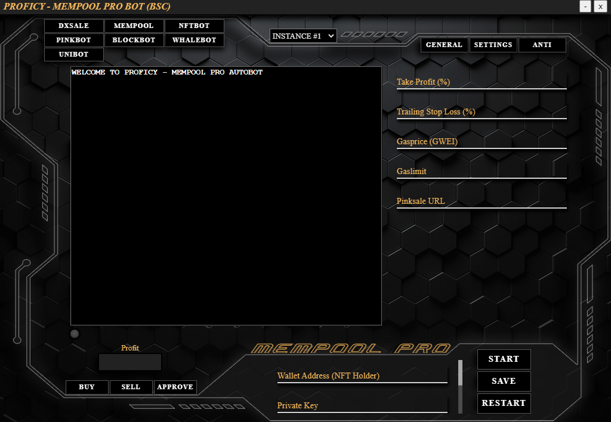
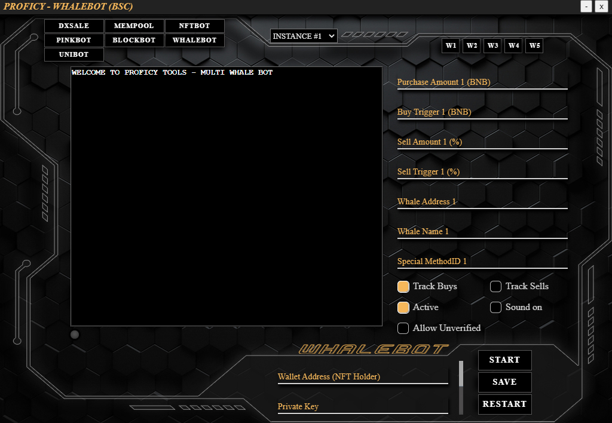

# BOT GUIDE

## DISCLAIMER  
PROFICY is not liable for any loss of funds through the use of the available bots or connecting your wallet to our minting dashboard. This includes every possible scenario (f.e. bad trading habits, a user being victim of a cyber attack, servers being attacked, buying cryptocurrencies run by malicious developers, etc.)  

We explcitly recommend **NOT TO USE YOUR MAIN WALLET** for any of our bots or to mint an NFT through our website. This is common practice with these kind of products and should always be kept this way.  

We at PROFICY took every available measure to prevent anything bad to happen on our end.  

## TABLE OF CONTENTS
[**GENERAL**](#general)  
[**MEMPOOL/BLOCKBOT**](#mempoolblockbot)  
[**DXSALE/PINKSALE/UNICRYPT BOT**](#dxsalepinksaleunicrypt-bot)  
[**NFT BOT**](#nft-bot)  
[**WHALEBOT**](#whalebot)  
[**ANTI-SNIPE**](#anti-snipe)  
[**CHANGELOG**](#changelog)  

## GENERAL  

  

**Navigating the UI**  
1.	In this area you can switch between the bots. Keep in mind, switching to another bot will quit all processes running in the current bot. If you want to run more than one bot at the same time, you have to start multiple instances.
2.	Here you can switch to another instance if you want to run multiple instances of the same bot.  
3.	In this area you need to fill the forms with your desired inputs.
4.	Use this scrollbar to get to the node options.
5.	Click on these arrows to switch between wallets and their according inputs.
6.	In this area you can find additional features.

### **IMPORTANT:** 
- The wallet and private key inputs are separated for each bot.  
- Your private key is different from your seed phrase. Follow these instructions to export your private key for use in the Proficy app: https://metamask.zendesk.com/hc/en-us/articles/360015289632-How-to-Export-an-Account-Private-Key.
-	On first start-up fill in the forms (especially your wallet information) and press SAVE. The last saved data will be used to fill the forms on the next start/restart of the app.
-	After switching to another node, press SAVE and RESTART to use the new settings.
-	DO NOT CLICK THE START BUTTON ANYMORE ONCE YOU'VE CLICKED IT! You would run the same script multiple times, which would lead to interference and poor performance/double buying.
-	If you are done with sniping on Mempool or Blockbots and don't have antiRug or sell-methods running, PLEASE PRESS RESTART BEFORE USING THE MANUAL SELL OR BUY BUTTONS. Otherwise unpredictable behaviour will occur. (we are on it to make this not necessary)
-	After starting the main process via the START button, any input changes made later on will not take effect on the currently running main process. The new inputs would only be availabe for certain features like "cancelTx" and "upGas" in the NFT bot. If you want to make changes to the inputs used in the main function, press RESTART and fill in your new inputs.  
-	Make sure your computer sleep settings are off if you're letting the app run for long periods of time unattended.  

## MEMPOOL/BLOCKBOT
The methods and inputs for the Mempool Bots and BlockBots are mostly the same, some features are only available on the mempool bots and marked as such.  

  

### **Tab General**
**Purchase Amount:** The amount of BNB you want to spend on a snipe  
**Contract Address:** The address of the token contract you want to snipe  
**Dev Wallet Address:** This should be left empty. If there is input in this field before pressing START, it will override any of the following. If DxSale and PinkSale are not checked, the bot will use the contract owner address as dev wallet address. If DxSale or PinkSale is checked, the bot will fetch the presale owner address. In rare occasions the bot can’t find the owner address on a fairlaunched contract. In this case it will throw an error and ask you to put the owner address in there manually.  
**Track Dev:** This method will track the dev wallet and tries to buy everytime the dev wallet makes a move. The most important usecase of this is for launches on which the devs already added liquidity but disabled trading. With this method you can snipe on any launch. It can be combined with any of the following methods, besides Snipe Liquidity.  
**Snipe Liquidity:** This method will only snipe if liquidity is added. It can be used on fairlaunches, DxSale launches and PinkSale launches. It can be combined with any of the following methods.  
**DxSale:** If this is checked, the presale owner address is used as dev wallet address. Leave the dev wallet address input empty.  
**PinkSale:** If this is checked, the presale owner address is used as dev wallet address. Leave the dev wallet address input empty. In order to make this work you have to put the PinkSale URL in the according input in the settings tab.  
**Sell Methods:** If this is checked, the trailing stop loss and take profit methods are activated. You can find the inputs in the settings tab.  
**Anti maxTxAmount:** If this is checked, the bot will do split transactions. This applies both to buying and selling. This means you will do multiple buys/sells in one single tx. You can find the inputs in the settings tab. To make this work, you have to make sure the listing price and maxTxAmount inputs are correct and don’t exceed your purchase amount. The bot will do the math for you and let you know if something is wrong. Also consider to increase the Gaslimit significantly. If a contract is poorly designed, it might take up to 1mil Gaslimit to make a single buy call. This means if you want to do 10 buys in one single tx you’d need at least 10mil Gaslimit. (We can’t estimate the gaslimit for you if the contract has no liquidity pair on the router)  
**Anti Rug:** If this is checked, the anti rug methods are active. This means the bot will automatically frontrun the dev’s tx when they change the txFee, maxTxAmount, disable trading or try to blacklist your wallet. You can find the according inputs in the anti rug tab.  
**Track Function (Mempool only):** This function is only of use, if liquidity is already added! It allows you to track one specific function that has to be called by the contract owner, in order to enable trading. The bot will present you a selection of available functions in the dropdown menu below. It is obviously only available in Track Dev mode. It can be used on its own or combined with Manual AntiSnipe - on Automatic AnitSnipe in Track Dev Mode it is mandatory.
**Manual AntiSnipe:** If this is checked, the "block to aim at" mode is activated. You can find the input in the settings tab. Since V2 your transaction will revert if you set up the bot wrong and would try to snipe a block in which AntiBot measures are still in place, in order to protect you from losing money.\
**Auto AntiSnipe (Mempool version):** If this is checked, the bot will detect the first block without AntiBot measures automatically. You have to specify an amount of blocks the bot should test, before it stops testing each block for entry and a maximum total txFee you are willing to accept to make the bot snipe. If the bot made a successful snipe, it will stop the process by itself. These methods are happening on-chain, to guarantee you the fasted possible automatic snipe, which means they come with a cost - gas fees for tested blocks mainly. Note: This is supposed to be used on tokens with AntiBot measures, thus it will start sniping in block 1, not block 0! Once the Proficy Node Network is in place, it will start with block 0. If a token has no AntiBot measures and allows you to snipe block 0, there is no need for Automatic AntiSnipe.\
**Auto AntiSnipe (Blockbot version):** If this is checked, the bot will detect the first block without AntiBot measures automatically. You have to specify an amount of blocks the bot should test, before it stops testing each block for entry. If the bot made a successful snipe, it will stop the process by itself. These methods are happening off-chain, which means they won't cost you any gasfees, but come with the usual delay of 1 block on blockbot.

  

### **Tab Settings** 
**Take Profit:** The bot will sell all your token holdings once your profit target is reached. (in %) Set it to an unrealistically high value to only use trailing stop loss.  
**Trailing Stop Loss:** The bot will sell all your token holdings once your stop loss target is reached. (in %) Set it to 100% to only use the take profit method. The bot will automatically track the current price-level for you. Example of this method: You set it to 30%. The token launches and hits it’s first ATH, it retraces by 20% and keeps going further up reaching a new ATH. If the price-level drops 30% or more below this ATH the bot will sell all your token holdings. NOTE: If you sniped on launch of a presale and people immediately dump, it will trigger the sell mechanism. So choose wisely when to use this.\
**Gasprice:** This value is only used for buys if you activated the Anti Snipe method and for all sell methods. It is also used for the normal buy/sell buttons.  
**Gaslimit:** This value will be used for all your transactions.  
**PinkSale URL:** If the PinkSale checkbox is checked, the presale URL needs to be put in here.  

  

### **Tab Anti** 
**Max txFee allowed:** The maximum txFee the devs can set any of the fees to before the bot sells all your token holdings. Smart scammers do it in multiple steps by adding up liquidity fee, tax fee etc.
Usually the devs shouldn’t tinker manually with the fees at all, so you could set a fairly low value to trigger your sells.  
**Min txAmount allowed:** The minimum amount of tokens the devs can set maxTxAmount to before the bot will sell all your token holdings.
**Liquidity Removal:** The percentage of LP the devs can remove, before the bot will sell all your token holdings. Don't set this too low because some contracts have different ways to interact with LP, which could trigger the sell mechanism.\
**Max total txFee allowed:** The maximum fee allowed in total (buy + sell) to let the bot snipe. We recommend 70 as default value. If you'd set it f.e. to 100% and during AntiBot measures there is a 90% buyFee but a standard 8% sellFee, the bot would snipe into such a block with antiBot measures. If you set it to 50% and a token has (for whatever reason) a buyFee of 30% and a sellFee of 30%, the bot wouldn't snipe at all.\
**Amount of blocks to test:** This is the amount of blocks the bot will test for AntiBot measures, before it stops if it couldn't detect a safe block. Keep in mind, on mempool bots this process is happening on-chain and thus each tested block comes with the cost of gasfees.\
**Block to aim at:** This is the block your bot aims to buy in ONLY WHEN MANUAL ANTISNIPE IS ACTIVE. How to count: If there is a 2 block antibot measure in the contract, you want to aim at block 2. This may sound confusing. Explanation: Using Anti-Snipe methods when there are no antibot measures in place makes no sense. It means you would aim at block 0 or block 1 depending on if you start counting at 0 or 1. We start counting at 0, which means THE BLOCK LIQUIDITY IS ADDED IN IS BLOCK 0! So in our example: Block liquidity is added = block 0 with antibot, next block = block 1 with antibot, next block = block 2 without antibot active.
DO NOT TRY TO SET THIS VALUE TO ZERO AND ACTIVATE ANTI-SNIPE! This would make no sense.\
**maxTxAmount:** The maximum amount of tokens that are allowed to be bought/sold in one call on this contract. You can find this value in the read functions of the contract. Simply copy paste it, the bot will format the value if it is multiplied by token decimals.  
**Listing Price:** The amount of tokens one gets for 1 BNB. You can find this on the presale page or if it is a fairlaunch you have to ask the devs for it. This value is only used for split transactions if Anti maxTxAmount is activated.  

## DXSALE/PINKSALE/UNICRYPT BOT

  

**IMPORTANT: Please synchronize your system time before pressing start! Go to Time.is and check your offset. If needed, right click on your system time -> change date & time -> synchronize -> check your offset again\
If you don't do this, you are likely to snipe too early or too late.**

### **Tab General**  
**PinkSale/DxSale/Unicrypt Link or ID:** Simply paste the sale URL here or type in the sale ID.  
**BNB Amount:** The amount of BNB you want to contribute per wallet.  
**Number of Wallets:** The amount of wallets you want to snipe on this presale.  
**Gas Price:** The amount of GWEI you want to use on a public presale. If you are on a whitelist, the bot will automatically detect this and use a low Gasprice. Also when a whitelisted presale switches to public without delay timer, the bot will use very low GWEI since it uses mempool techniques to snipe.
Be aware you have to set this for each wallet separately. In order to not be detected as a bot, please vary your inputs even if it is just by a few GWEI.  
**Gas Limit:** The Gas limit you want to use on your snipe. Usually not more than 140k are necessary to contribute to a DxSale presale. PinkSale requires gas limits higher than 250k to avoid running out of gas errors.
When using Metamask or Trustwallet the maximum txFee when sending BNB to a presale token address is 1BNB. If you use our nodes you can exceed this value by whatever you like, although it’s 99% of the time not necessary.  
**Time Delay:** The amount of time the bot will send your tx before a public presale starts. Since every user has a different location and thus a different delay, we need this input. 4 seconds has worked consistently for us, but you might have to dial it in. (decimals are allowed). Time delay is similar for Unicrypt, but is based on time before the startBlock to send the contribution.  
**Changed Start Block Gas Price**  (Unicrypt only) Sometimes a dev will change the start block of a Unicrypt presale as an anti bot measure. Most people won't catch this and you can often get in the presale with much lower gas since we automatically detect if they change the start block.  
**Sell Initial at Profit:** If Sell Initial is checked, the bot will sell your initial contribution of all wallets together at your chosen target. You can also use the Sell Initial button to sell your initial at any given point.  
**Sell One:** The Sell One button will sell all token holdings of the currently at the bottom displayed wallet.  
**Sell All:** The Sell All button will sell all token holdings of all wallets.  
**Claim:** If claim is checked, the bot will auto claim on all your wallets as soon as it is possible by using mempool techniques. If you forgot to check this, you can always use the claim button to manually claim.  
**Anti Rug:** If this is checked, the anti rug methods are active. This means the bot will automatically frontrun the dev’s tx when they change the txFee, maxTxAmount or disable trading. You can find the according inputs in the anti rug tab.  

   

### **Tab Anti-Rug**  
**Max txFee allowed:** The maximum txFee the devs can set any of the fees to before the bot sells all your token holdings. Smart scammers do it in multiple steps by adding up liquidity fee, tax fee etc. Normally the devs shouldn’t tinker manually with the fees at all, so you could set a fairly low value to trigger your sells.  
**Min txAmount allowed:** The minimum amount of tokens the devs can set maxTxAmount to before the bot will sell all your token holdings.  
**Liquidity Removal:** The percentage of LP the devs can remove, before the bot will sell all your token holdings.  
## NFT BOT  

   

### **Tab General**  
**Contract Address:** The contract address of the NFTs you want to snipe  
**Dev Wallet Address:** If empty the bot will set the contract owner address as dev wallet address. In very rare occasions the bot can’t fetch it. If so it will alert you and you have to put the address in there manually.  
**NFT Amount per Tx:** Specify how many NFTs you want to mint in one tx when using multiple wallets. IF YOUR ARE USING BYPASS MAXMINT, PLEASE SET IT TO THE SAME VALUE AS MAXMINT!\
**NFT Price:** The price for one NFT in BNB.  
**Gasprice:** Only used when 1st Block Mode or Presale Timer Mode is active. Choose your GWEI to snipe when minting is enabled.  
**Gaslimit:** Choose your gaslimit according to how many NFTs you want to mint per tx. On badly designed contracts one mint call can take up to 1mil in gas. So for 10 NFTs you’d need 10mil gaslimit. When using the bypass maxMint mode, you should set this to a very high value according to the amount of NFTs you want to snipe. (Don't exceed 50mil)\
**Anti maxMint:** This mode allows you to bypass the limited amount of NFTs you are usually allowed to mint in one tx. You can find the inputs in the maxMint tab.\
**1st Block Mode:** When this mode is active, you are not aiming at the same block as minting is enabled. This allows you to use higher GWEI. If this mode is inactive, the bot will snipe block 0 with fixed gwei because of the nature of mempool sniping. This can‘t be combined with anti maxMint or Presale Timer mode. (makes no sense)  
**Balance Button:** This will show you all BNB balances on the amount of wallets you selected.  
**upGas Button:** Sometimes on a mint the needed gas to successfully get your mint tx through increases drastically in the first few blocks. In the case you missed block 0 and ended up in block 1 with low GWEI you can resend all your sent txn with one click. It will directly take the GWEI and gaslimit from your inputs – so you need to change them on the fly before clicking the button.  
**Cancel Button:** Sometimes on a mint the needed gas to successfully get your mint tx through increases drastically in the first few blocks. In the case you missed block 0 and ended up in block 1 with low GWEI you can cancel all your sent txn with one click if you like to.  

   

### **Tab Inputs**  
**Enable Minting Function:** You need to fill this input with the function the contract owner will call to enable the public minting. This function could be named whatever the devs have in their mind. Typical names are unpause, saleOpen, startSale etc.  
You can find this function in the contract. You have to copy the first line of the function without any semi-colons or brackets at the end. Also make sure you don’t add whitespaces at the beginning or at the end.  
Example: function pause(bool val) public  
**Mint Function Arguments:** You need to fill this input with the arguments that you want to pass to the mint function.  
Example Mint Function: function mint(uint256 nftAmount, address _to) public  
Example Mint Arguments: 10, "0x1234124121251251241233523523235235"  
The arguments need to be separated by commas, integers are typed in as they are a and addresses have to inside quote marks. Make sure you put the arguments in the correct order. (same order as defined in the function)  
If there are no mint arguments, leave it empty. NOTE: THE NFT PRICE IS NO FUNCTION ARGUMENT!\
**Presale Timer:** Sometimes devs decide to open the sale to the public after a timer runs out for presale mints. If this is the case you can find that timer in the contract or in the tx the contract owner started the presale with. If the checkbox presale timer is checked, the bot will snipe on the exact block the mint goes public after the timer ran out. The input format needs to be seconds.\
**Minting Dashboard URL:** This features is not yet available. If devs try to hide their NFT contract, we will fetch the contract address and it’s functions, even if it is unverified.  
## WHALEBOT  

   

**Purchase Amount:** Choose the amount of BNB you want to buy on every buy tx the selected whale makes. You can set this individually for every whale you track.  
**Buy Trigger:** Choose the amount of BNB the whale has to buy for in order to trigger the bot to buy. You can set this individually for every whale you track.  
**Sell Amount:** Choose the percentage of your token holdings you want to sell on every sell tx the selected whale makes. You can set this individually for every whale you track.  
**Sell Trigger:** Choose the percentage of token holdings the whale has to sell in order to trigger the bot to sell. You can set this individually for every whale you track.  
**Special MethodID:** This will allow you to track bots/whales that use custom smart contracts to buy/snipe on tokens. Simply put the methodID the tracked wallet uses to buy tokens in here. Example Input: 0x225c1d65 (MethodIDs of Proficy bots are excluded!)
**Active Checkbox:** If checked, the bot will track the selected whale.
**Sound on Checkbox:** If checked, the bot will notify you when it has frontrun a whale.
**Allow unverified:** If this is not checked, the bot will check BEFORE frontrunning if a contract is verified and only buy if so. The bot, our nodes and our methods themselves are more than fast enough to consistently frontrun tx although we check if a contract is verified inbetween. Nevertheless, BSCscan is affected by network lags, node syncing issues, maintenance etc., which results in poor response performance. If this is the case, this will lead to buying after the whale if you choose to only allow verified contracts under such conditions.

## ANTI-SNIPE

In the following section we'll show you some examples of anti-bot measures on common contracts, how to spot them and how to bypass them.

General understanding how those measures work:

There are a few methods to trap people sniping a launch. It could be very high taxes, saving your address to a mapping and not allowing you to sell anymore, blocking any buys, blocking multiple buys per block - just to name a few.

When looking at it from a technical side, it is always related to the transfer function. So with this in mind, if we don't find any noticable lines in the contract code, it is best practice to have a look at the transfer functions of the contract, to make sure there really is no antibot.

The easiest and foremost way to spot anti-bot measures in a contract quickly, is by copying the contract from BSCScan to a text editor that supports solidity and search it by keywords. We recommend to use https://remix.ethereum.org or VS Code if you have it installed.

Enter the search with CTRL + F and search for the following words: snipe, anti, launch, bot, block.

You might find something that looks like this:

In this case the anti-snipe would be active for 3 blocks and you would have to aim at block 4. Why? Because "tradingActiveBlock + 2 >= block.Number" can be translated to: If block liquidity is added in plus 2 blocks are greater or equal than current blocknumber, antibot is active - so 3 blocks.

"block.Number" = the current block\
"tradingActiveBlock" = the block liquidity is added in (First block to wait)\
"+ 2 >=" (another 2 blocks to wait)

If it would say "tradingActiveBlock + 2 > block.Number" it would be only 2 blocks with anti bot and you'd need to aim the bot at block 3.

This translates to: If block liquidity is added in plus 2 blocks is greater than current blocknumber, antibot is active - so 2 blocks.

Be very careful with the " >= " and double check!

You could also find something like this:

Or like this:

If it is block.Number the value you are looking for represents actual blocks. If it it block.timestamp, the value you are looking for is most likely in seconds. (1 block has 3 seconds on BSC)

They are essentially all the same and are based on the same principle. All you need to do is find the value for the variable that defines how long the anti bot measure will be in place and do the math.

This value can also be defined in a write function the contract owner can call. Since we expect you to only snipe verified contracts, you can simply go to the contract owner address and check shortly before launch if the owner calls any function that sets the antibot value. If you find a transaction that calls this function, open it, click on "click to see more" and grab the value from the transaction data input. (It's always the last few values of the input - Make sure to grab it from the correct input argument if there are more than one! Example: function setAntiBot(address _to, uint256 count) => transaction data input will have two lines, [0] and [1]. Since you obviously would want the value of count, you have to grab it from [1].
If it is a value bigger than 9, it will be in hex. So copy/paste it to a hex/decimal converter to get the value.

Some devs choose to give the variables or functions uncommon names. If you spot anything irregular, that doesn't look like a standard variable or function, check what it does.

If you spot anything that looks like this:

Check where the interface is leading to. In this case the interface antiSnipe is leading to an unverified contract, through which the devs can set the anti bot specific values. Please just stay away from these. We can't disclose any further.

If the interface is part of the same contract, just check the functions it contains and wait for the contract owner to call them.

One more exceptional example:

If you spot something like this, you are not able to use bypass maxTxAmount. The only way to bypass this, would be by using multiple wallets while sniping.

And of course, always check maxTxAmount and maxWallet on the contracts you want to snipe. 

The easiest way to check if your maxTxAmount values in the bot are correct, is to fill the input without decimals. So if a token has 9 decimals and the maxTxAmount is displayed with way too many zeros, remove 9 zeros to get the actual token amount. If it is 18, remove 18 zeros and so on.
As a result you should get a reasonable amount of tokens for maxTxAmount in relation to the listing price.

Don't get caught!

## CHANGELOG
### v1.1.7 2021-12-7
* [Enhancement] Detect start block change and allow users to choose block time delay before buying (Unicrypt)
* [Bugfix] Fixed an issue where certain PinkSale links would cause the app to crash (Mempool, Blockbot, PinkSale)

### v1.1.6 2021-12-5
* [Bugfix] Fetch correct contract address from etherscan (ETH NFT Bot)
* [Bugfix] Fixed NFT issue (Mempool High)
* [Enhancement] Added a new anti rug function (Mempool, Blockbot, Presale)
* [Bugfix] Prevent app from crashing when an unverified contract is found (Mempool, Blockbot, Presale)
* [Bugfix] Fixed manual selling issue (Mempool, Blockbot)

### v1.1.5 2021-12-4
* [Enhancement] Allow empty inputs if you're not using a sniping feature (Mempool, Blockbot)
* [Enhancement] Automatically increase gas for anti max tx amount to prevent out of gas errors (Mempool, Blockbot)
* [Enhancement] Automatically trim extra spaces from inputs and allow special characters like commas (All)
* [Feature] Added Unicrypt presale sniper (Unicrypt)
* [Bugfix] Fixed a token limit calculation that affected anti max tx amount (Mempool, Blockbot)

### v1.0.4 2021-11-17
* [Bugfix] Added more explicit language for "blocks to aim at." (Mempool, Blockbot)
### v1.0.4 2021-11-17
* [Bugfix] Fixed a bug affecting auto fetching sniper contract (Mempool, Blockbot)
### v1.0.4 2021-11-15
* [Bugfix] Fixed calculation to auto deposit WBNB to custom sniping smart contract (Mempool, Blockbot)
* [Bugfix] Fixed an issue sniping liquidity addition on PinkSales (Mempool, Blockbot)
### v1.0.3 2021-11-14
* [Bugfix] Added auto approve for WBNB on custom sniping smart contracts (Mempool, Blockbot)
* [Bugfix] Improved method to automatically pull ABIs from BscScan (all bots with anti-rug)
* [Bugfix] Removed ability to resize window
### v1.0.2 2021-11-12
* [Enhancement] Updated Anti-Rug
* [Enhancement] Auto fetch sniper contract (Mempool, Blockbot)
* [Bugfix] Prevent user from using not enough Gaslimit (Mempool, Blockbot)
* [Bugfix] PinkSale URL is saved and form filled upon start (Mempool, Blockbot)
### v1.0.1 2021-11-11
* [Bugfix] Fixed Sell percentage calculation (Whalebot)
### v1.0.0 2021-11-10
* Proficy initial release

